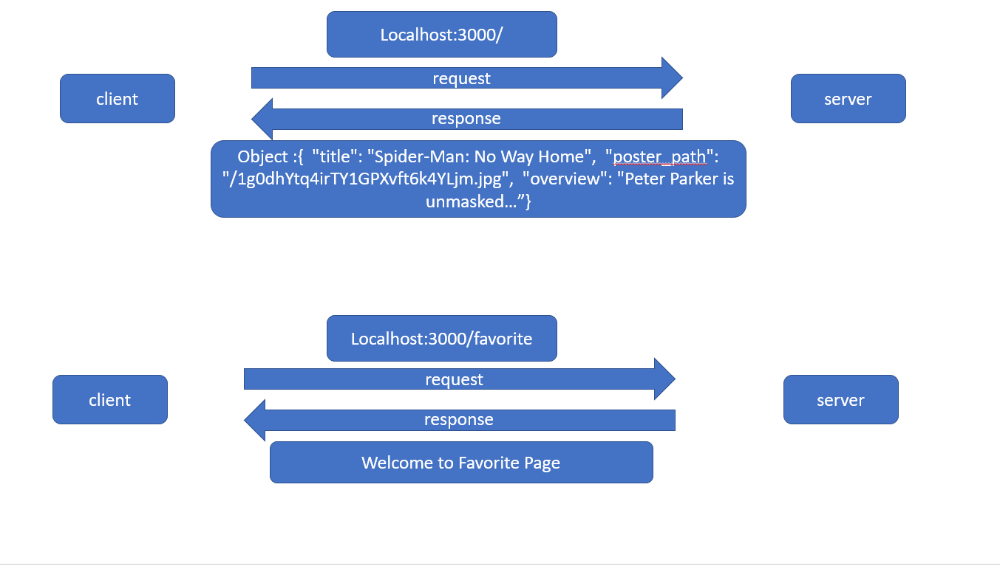
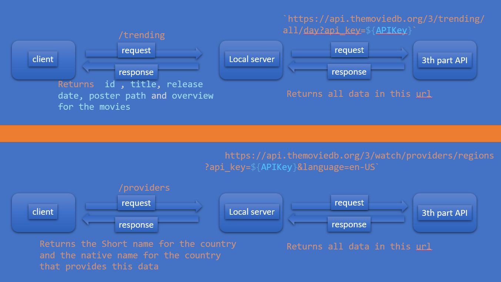
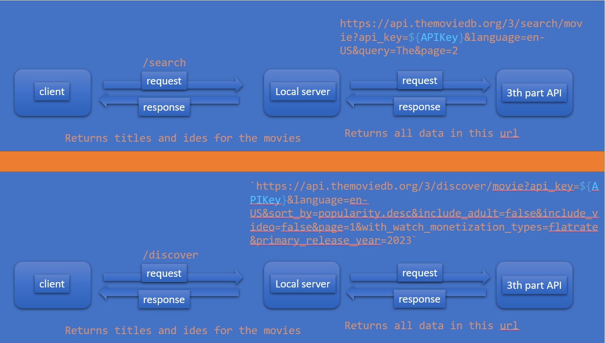
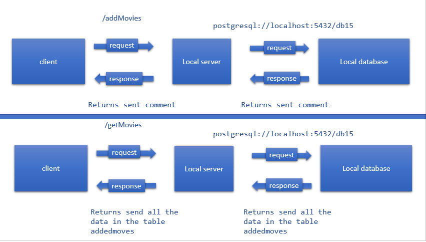
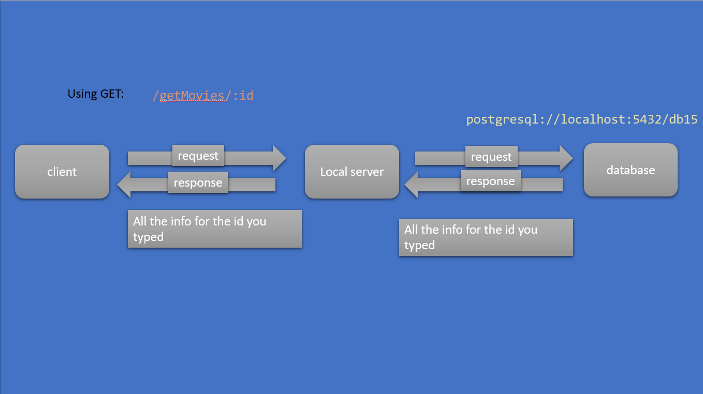
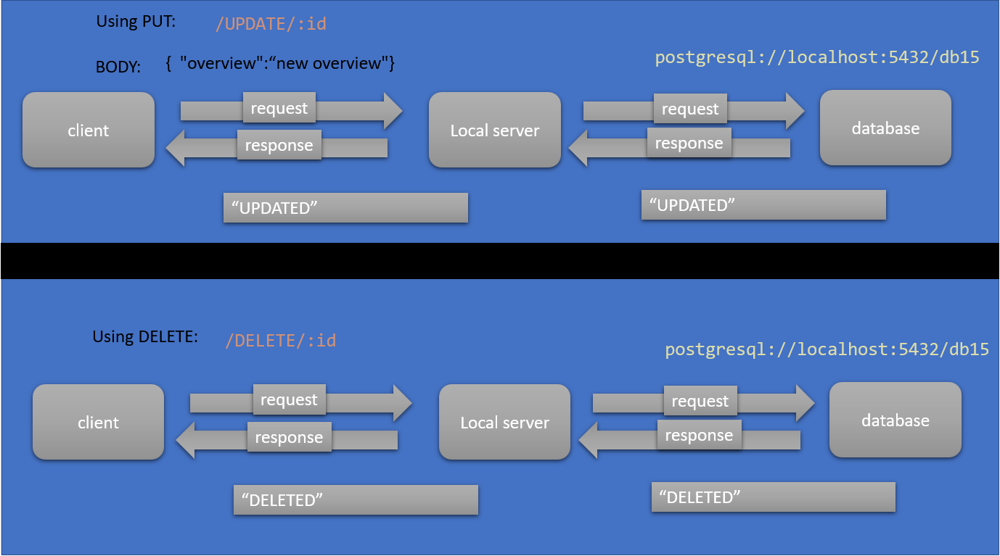
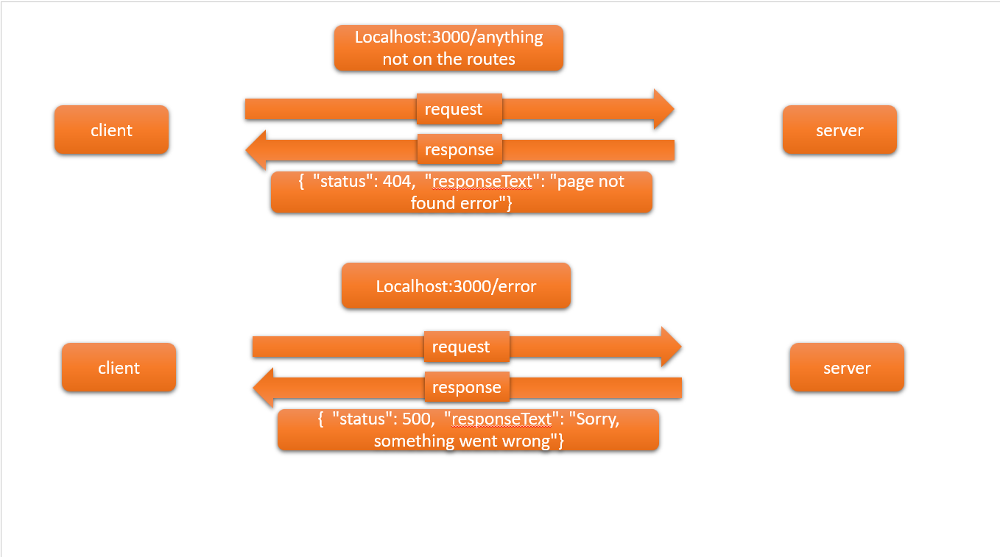

# Movies-Library-v2.0
**Author Name**: osama alkarmy

## WRRC
</img>

**3th party wrrc**
</img>
</img>
**database wrrc**
</img>
</img>
</img>
**Error WRRC**

</img>
## Overview
simple project5 that is a server module for a basic movie library with a favorite page and a error massege if wrong request was sent .
## Getting Started
to start this project you should install express
"npm install express cors dotenv axios pg" then you could type on your ubantu "npm start" this will show a massege `Listening on 3000: I'm ready` 
and in this case you are setup right.
## Project Features
 go to your borwser and wirte `localhost:3000/`
 you will see the title of "Spider-Man: No Way Home"
 and some info on this movie.

 Also if you typed `localhost:3000/favorite`
 you will be in the favorite site.

 if you typed `localhost:3000/search` you will see an data that includes the title and the id of some movies from an 3th party API.
  if you typed `localhost:3000/discover` you will see an data that includes the title and the id of diffrent movies than the search as the api requesdt changes  from an 3th party API.

  if you typed `localhost:3000/trending` you will see an data that includes the title , id ,release date and the overview of the trending  movies .
 
 
  if you typed `localhost:3000/providers` you will see an data that includes the providers short name as 2 letters and the natve name for the countrys that are providers.
 
 
  if you typed `localhost:3000/addMovies` you will add data that includes the name and the info for the movie you want to add in the database use thunder extention and the post instead of get and type te add movie as a json file such as `{"nameofmove":"the name of the movie you want to add", "info":"the information of the movie you want to add"}` in the body to add if you add succsessfully you  will receive a massege "sent"  .
 
if you typed `localhost:3000/getMovies` you will see the data that you add using `localhost:3000/addMovies`  in this you will use the normal get in thunder or your web browser.
if you typed `localhost:3000/getMovies/id` you will see the data for this id that you shows  in this you will use the normal get in thunder or your web browser.

  if you typed `localhost:3000/UPDATE/id` you will update overview for the id you choose if it updated succsessfully you  will receive a massege "UPDATED"  .
  if you typed `localhost:3000/DELETE/id` you will delete  the id you choose if it deleted succsessfully you  will receive a massege "DELETED"  .

 if you typed any other path as example:
 `localhost:3000/oaufh` you will be in the page not found and the statuse will be 404 and the last case is if you typed `localhost:3000/error` you will be in the server error status 500. 